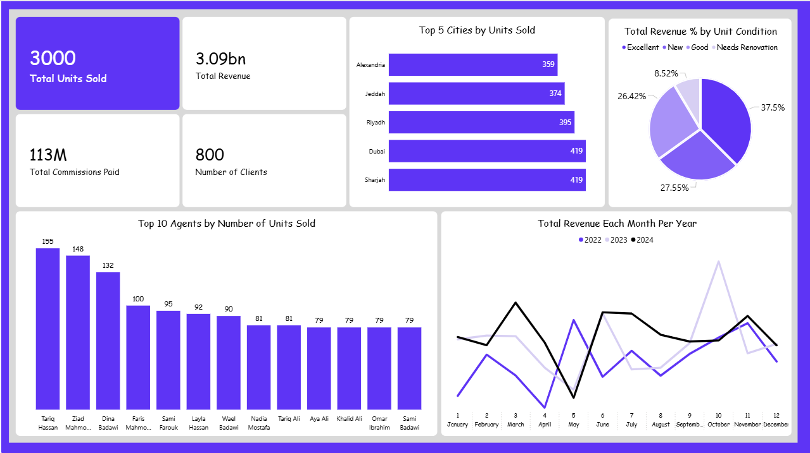

# Real Estate Sales Dashboard Using PowerBI

**Primary Tool: Microsoft Power BI**

---

## Dashboard Preview


---

## Data Model

The project follows a **Star Schema** with one central fact table and four dimension tables.

```
FACT_Transactions
├── DIM_Date        — Year, Month, MonthName (time intelligence)
├── DIM_Agent       — Agent name and performance grouping
├── DIM_Property    — Property condition, city, type, area
└── DIM_Client      — Client identification and segmentation
```

### Fact Table — Key Columns

| Column | Description |
|---|---|
| TransactionKey | Unique transaction identifier |
| FinalPriceEGP | Final sale price in Egyptian Pounds |
| CommissionEGP | Commission earned on the transaction |
| ClientKey | Foreign key to DIM_Client |

---

## Key Performance Indicators

| KPI | Description |
|---|---|
| Total Units Sold | Count of completed transactions |
| Total Revenue | Sum of FinalPriceEGP across all transactions |
| Total Commissions Paid | Sum of CommissionEGP across all transactions |
| Number of Clients | Distinct count of clients served |

---

## Dashboard Page — Sales Overview

**Visuals:**
- KPI Cards — Total Units Sold, Total Revenue, Total Commissions Paid, Number of Clients
- Clustered Column Chart — Transaction count or revenue by Agent Name
- Clustered Bar Chart — Performance breakdown by Property Condition
- Pie Chart — Revenue or unit distribution by City
- Line Chart — Revenue or transaction volume by Month and Year (trend view)

**Filters available:** Year, Month, City, Agent Name, Property Condition

---

## Analytical Findings

### Agent Performance Concentration
The dashboard reveals transaction and revenue distribution across named agents. In most real estate markets, a small number of agents drive a disproportionate share of total revenue. If the data follows this pattern, the top two or three agents likely account for the majority of FinalPriceEGP and CommissionEGP totals.

**Implication:** Management should identify whether high-performing agents are concentrated in specific cities or property conditions, and use that insight to inform training programs, territory assignments, and commission structure design for lower-performing agents.

### Property Condition as a Revenue Driver
The breakdown by `Condition` (property state — new, used, under construction, etc.) enables comparison of average transaction value and volume across property types. Higher-condition properties typically command higher prices but move in lower volumes.

**Implication:** If the data shows that one condition category generates disproportionately high revenue despite lower unit counts, the brokerage should consider reallocating agent time and marketing budget toward that segment rather than spreading resources evenly across all property conditions.

### City-Level Market Prioritization
The pie chart segmentation by City provides a clear view of which geographic markets contribute most to total revenue and client volume. A city accounting for a large revenue share but a small client count indicates high average transaction value — a premium market. The inverse indicates a volume market.

**Implication:** Expansion and staffing decisions should be informed by city-level revenue density rather than raw transaction counts alone. Cities with high revenue-per-transaction ratios may justify dedicated agents or targeted property acquisition partnerships.

### Seasonality in Transaction Volume
The monthly line chart tracks transaction activity over time, making seasonal peaks and troughs visible. Real estate markets typically exhibit seasonal patterns tied to academic calendars, economic cycles, and regional factors.

**Implication:** If the line chart shows consistent volume spikes in specific months, the brokerage should pre-position agent capacity, marketing spend, and listing inventory ahead of those periods rather than responding to demand after it has already peaked.

---

## Tools & Technologies

| Tool | Application |
|---|---|
| Power BI Desktop | Data modeling, DAX measures, dashboard authoring |
| Power Query (M) | Data loading and transformation from source |
| DAX | KPI calculations — revenue sums, commission totals, distinct client count |
| Star Schema | Dimensional modeling across four dimension tables |

---

## Repository Structure

```
real-estate-sales-dashboard/
│
├── Real_Estate_Sales_Dashboard.pbix     # Power BI report file
├── Dashboard.png
└── README.md
```

---

## Setup Instructions

1. Clone this repository.
2. Open `Real_Estate_Sales_Dashboard.pbix` in Power BI Desktop.
3. If prompted, update the data source connection to match your local environment.
4. Click Refresh — all KPIs and visuals will populate from the connected data model.

---

## Author

**Abdallah ElZakaziky**
[LinkedIn](https://www.linkedin.com/in/abdallahelzakaziky/) 